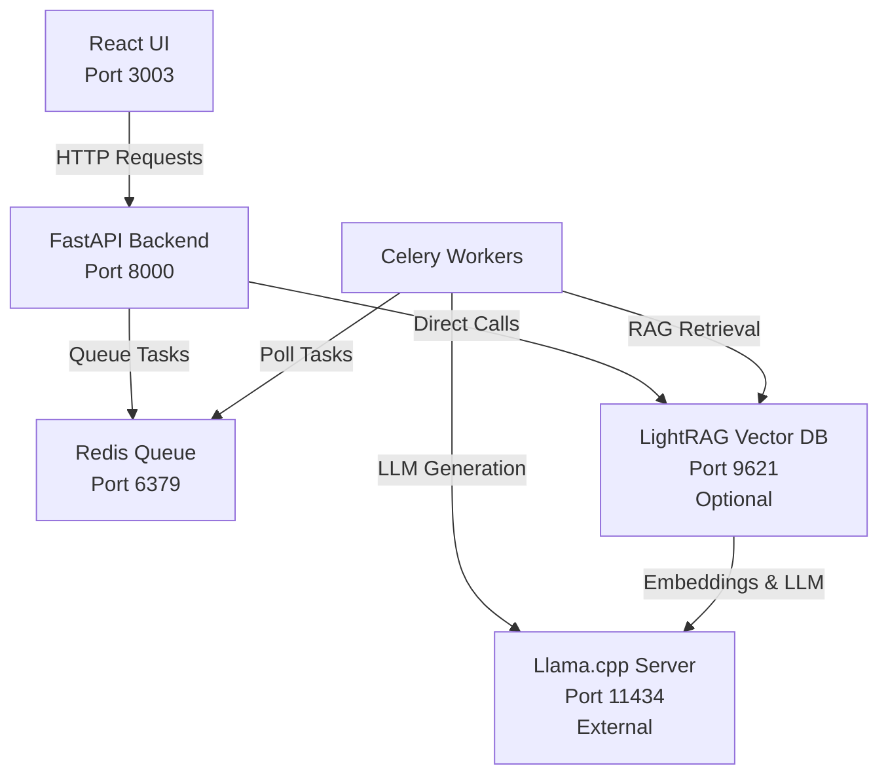

# Decision Generator Analyzer

AI-powered system for generating and analyzing Architectural Decision Records (ADRs) using multiple personas and vector-based retrieval.

## Project Progression

This project follows a phased development approach, with each phase representing a major milestone:

| Phase | Status | Description |
|-------|--------|-------------|
| **Phase 1: Generation** | 🚧 **In Progress** (v1.x) | Multi-persona ADR generation, import/export, async processing |
| **Phase 2: Analyzation** | 📅 Planned (v2.x) | Contextual analysis, conflict detection, reasoning validation |
| **Phase 3: Decision Change Trees** | 📅 Planned (v3.x) | Explicit relationships, dependency graphs, change impact analysis |
| **Phase 4: Decision Severity Scoring** | 📅 Planned (v4.x) | Quantitative impact scoring, criticality metrics, risk assessment |
| **Phase 5: Compartmentalization** | 📅 Planned (v5.x) | Enterprise features, RBAC, multi-tenancy, audit logging |

For detailed information about each phase, including planned features, technical objectives, and use cases, see [docs/PHASES.md](docs/PHASES.md).

## Features

- **Multi-Persona Analysis**: Analyze ADRs from different viewpoints (engineer, customer support, philosopher, etc.)
- **Vector Storage**: Store and retrieve ADRs using LightRAG for semantic search
- **LLM Integration**: Connect to llama-cpp servers for AI-powered analysis
- **ADR Generation**: Create new ADRs based on context and related decisions
- **Conflict Detection**: Identify conflicts and continuity issues across ADRs
- **Periodic Re-analysis**: Automated web search and re-assessment of decisions
- **Web UI**: Modern React interface for ADR management and analysis
- **Queue System**: Async processing with Redis and Celery for bulk operations

## Quick Start with Docker

1. Clone the repository:
```bash
git clone <repository-url>
cd decision-analyzer
```

2. Configure your environment (copy `.env.example` to `.env` and update):
```bash
cp .env.example .env
# Edit .env to set LLAMA_CPP_URL to your Ollama server
```

3. Start all services with bundled LightRAG:
```bash
docker compose --profile lightrag up --build
```

Or without bundled LightRAG (requires external LightRAG instance):
```bash
docker compose up --build
```

4. Open your browser to `http://localhost:3003`

For detailed configuration options and troubleshooting, see [docs/QUICKSTART.md](docs/QUICKSTART.md).

The system includes:
- **Frontend**: React/Next.js UI on port 3003
- **Backend API**: FastAPI server on port 8000
- **Redis**: Queue system on port 6379
- **Celery Worker**: Background task processing
- **LightRAG**: Vector database and RAG service on port 9621 (optional via `--profile lightrag`)

> **Note**: The system includes an optional bundled LightRAG service. Use `--profile lightrag` to enable it, or point to your own external LightRAG instance. See [LightRAG Configuration](#lightrag-configuration) for details.

## Development Setup

**Recommended: Use Docker for development** with hot-reload enabled:

```bash
make dev
```

This starts all services with automatic code reloading:
- **Backend API** (port 8000) - Auto-reloads on Python changes
- **Celery Worker** - Auto-restarts on Python changes  
- **Frontend** (port 3003) - Hot-reload on React/TypeScript changes
- **Redis** (port 6380) - Task queue

### Local Development (Without Docker)

If you prefer to run services locally:

#### Backend Setup

1. Install Python dependencies:
```bash
pip install -e .
```

2. Start Redis (if not using Docker):
```bash
redis-server
```

3. Run the backend API:
```bash
./scripts/run_backend.sh
```

#### Frontend Setup

1. Install Node.js dependencies:
```bash
cd frontend
npm install
```

2. Start the development server:
```bash
npm run dev
```

3. Open `http://localhost:3003`

### Manual Configuration

Copy and edit environment files:
```bash
cp .env.example .env
# Frontend .env.local can be created manually if needed for local overrides
```

## API Documentation

When running, visit `http://localhost:8000/docs` for interactive API documentation.

### Key Endpoints

- `GET /api/v1/adrs/` - List all ADRs
- `POST /api/v1/analysis/analyze` - Queue ADR analysis
- `POST /api/v1/generation/generate` - Queue ADR generation
- `GET /api/v1/analysis/task/{task_id}` - Check analysis task status
- `GET /api/v1/generation/task/{task_id}` - Check generation task status

## Architecture



## Usage

### Web Interface

1. **View ADRs**: Browse all ADRs in a card-based layout
2. **Analyze ADR**: Click "Analyze" to queue AI analysis with multiple personas
3. **Generate ADR**: Use the "Generate New ADR" button to create ADRs from prompts
4. **Track Progress**: Monitor queued tasks with real-time status updates

### Programmatic Usage

```python
from decision_analyzer import setup_logging, get_settings, LlamaCppClient, LightRAGClient

# Setup logging
setup_logging()

# Get configuration
settings = get_settings()

# Use clients
async with LlamaCppClient() as llama:
    response = await llama.generate("Analyze this decision...")

async with LightRAGClient() as lightrag:
    await lightrag.store_document("adr-001", "ADR content here")
```

## Testing

### Quick Start

Run all tests (backend + frontend):
```bash
make test
```

### Backend Tests

```bash
make test-backend              # All backend tests
make test-backend-unit         # Unit tests only
make test-backend-integration  # Integration tests only
make test-coverage-backend     # With coverage report
```

### Frontend Tests

First, install frontend test dependencies:
```bash
make install-frontend-deps
```

Then run tests:
```bash
make test-frontend             # Run all frontend tests
make test-coverage-frontend    # With coverage report
```

### Test Structure

**Backend**: Tests are co-located with source code in `tests/` subdirectories
```
src/adr_generation.py → src/tests/test_adr_generation.py
```

**Frontend**: Tests live alongside source files with `.test.tsx` extension
```
components/ADRCard.tsx → components/ADRCard.test.tsx
```

**Integration Tests**: Located in `tests/integration/`

See [docs/TESTING.md](docs/TESTING.md) for comprehensive testing guidelines.

## CI/CD Workflows

GitHub Actions workflows are configured for automated testing and releases:

- **Backend Tests** (`test-backend.yml`) - Python/pytest tests (stub)
- **Frontend Tests** (`test-frontend.yml`) - Vitest/React tests (stub)
- **Linting** (`lint.yml`) - Code quality and commit message validation (stub)
- **Docker Publishing** (`docker-publish.yml`) - Automated releases to ghcr.io (active)

Stub workflows are ready to activate when needed. See [.github/workflows/README.md](.github/workflows/README.md) for details.

## Docker Image Publishing

The project supports automated Docker image building and publishing with semantic versioning based on conventional commits.

### Local Development

Build and push images to a local registry:
```bash
# Check calculated version
make version

# Build images (current architecture)
make docker-build

# Build multi-architecture images (for Kubernetes with mixed architectures)
make docker-buildx-setup  # one-time setup
make docker-build-multiarch

# Push to local registry
make docker-push-local REGISTRY=192.168.0.118:5000

# Push multi-architecture images (recommended for Kubernetes)
make docker-push-local-multiarch REGISTRY=192.168.0.118:5000
```

### Production (GitHub Container Registry)

Images are automatically published to `ghcr.io` when **release PRs are merged from `develop` to `main`**. Version is calculated from all conventional commits since the last tag:

- Any `feat!:` or `BREAKING CHANGE:` → **Major** version bump (0.1.0 → 1.0.0)
- Any `feat:` → **Minor** version bump (0.1.0 → 0.2.0)
- Only `fix:`, `docs:`, etc. → **Patch** version bump (0.1.0 → 0.1.1)

This bundled release approach means multiple features and fixes are versioned together (e.g., 5 features + 3 fixes = one v0.2.0 release).

See [CONTRIBUTING.md](CONTRIBUTING.md) for branching strategy and release process.
See [docs/DOCKER_PUBLISHING.md](docs/DOCKER_PUBLISHING.md) for detailed information.
See [docs/MULTI_ARCH_BUILDS.md](docs/MULTI_ARCH_BUILDS.md) for multi-architecture build guide.
See [docs/LOAD_BALANCER_DEPLOYMENT.md](docs/LOAD_BALANCER_DEPLOYMENT.md) for deploying behind a load balancer.

## Development

### Code Quality

```bash
# Format code
black src/ tests/

# Sort imports
isort src/ tests/

# Type checking
mypy src/

# Linting
ruff check src/ tests/
```

## Project Structure

```
decision-analyzer/
├── src/
│   ├── __init__.py
│   ├── config.py          # Configuration management
│   ├── logger.py          # Logging setup
│   ├── models.py          # Data models (ADR, AnalysisResult, etc.)
│   ├── llama_client.py    # llama-cpp server client
│   └── lightrag_client.py # LightRAG server client
├── tests/
│   └── test_infrastructure.py
├── docs/
├── pyproject.toml
├── README.md
└── .env.example
```

## Configuration

The application uses the following environment variables:

### LLM Configuration
- `LLAMA_CPP_URL`: Primary URL of the llama-cpp server (required, default: http://localhost:11434)
- `LLAMA_CPP_URL_1`: Secondary llama-cpp server for parallel processing (optional)
- `LLAMA_CPP_URL_EMBEDDING`: Dedicated server for embeddings (optional)

See [docs/PARALLEL_PROCESSING.md](docs/PARALLEL_PROCESSING.md) for details on multi-backend configuration.

### LAN Discovery Configuration
Enable access from other machines on your local network:

- `ENABLE_LAN_DISCOVERY`: Set to `true` to allow access from other machines (default: false)
- `HOST_IP`: Your machine's IP address (e.g., `192.168.0.53`)

**Example for LAN access:**
```bash
# In your .env file or docker-compose environment
ENABLE_LAN_DISCOVERY=true
HOST_IP=192.168.0.53
```

When enabled:
- Frontend dynamically discovers the backend URL from the API
- CORS allows all origins (instead of just localhost)
- Access the UI from any device: `http://192.168.0.53:3003`
- The frontend will automatically use `http://192.168.0.53:8000` for API calls

See [docs/LAN_DISCOVERY.md](docs/LAN_DISCOVERY.md) for complete setup guide and troubleshooting.

**Security Note**: Only enable LAN discovery on trusted networks. This feature opens your backend to all devices on the network.

### LightRAG Configuration

The system includes an **optional bundled LightRAG service** that provides vector storage and graph-based RAG capabilities. No separate LightRAG deployment is required!

**Using the Bundled Service**

Start with the `lightrag` profile:
```bash
docker compose --profile lightrag up --build
```

The LightRAG service will automatically:
- Use your existing Ollama server (configured via `LLAMA_CPP_URL`)
- Start on port 9621
- Persist data in a Docker volume

No additional configuration needed! Just make sure your Ollama server is accessible.

**Customizing the Bundled Service**

Override defaults in your `.env`:
```bash
# Use different models
LIGHTRAG_LLM_MODEL=llama3.1:8b
LIGHTRAG_EMBEDDING_MODEL=nomic-embed-text

# Tune RAG performance
LIGHTRAG_TOP_K=100
LIGHTRAG_COSINE_THRESHOLD=0.3

# Use dedicated Ollama servers for LightRAG
LIGHTRAG_LLM_HOST=http://192.168.0.200:11434
LIGHTRAG_EMBEDDING_HOST=http://192.168.0.201:11434
```

**Using an External LightRAG Instance**

If you have an existing LightRAG deployment:
```bash
# In .env - point to your instance
LIGHTRAG_URL=http://your-lightrag-server:9621
LIGHTRAG_API_KEY=your-api-key

# Start without the bundled service (no --profile flag)
docker compose up --build
```

### Other Configuration
- `LOG_LEVEL`: Logging level (default: INFO)
- `LOG_FORMAT`: Log format, either 'json' or 'text' (default: json)

## Contributing

We welcome contributions! Please see our [Contributing Guide](CONTRIBUTING.md) for details on our development workflow and branching strategy.

**Quick Overview:**
- Feature branches → `develop` → `main` (for releases)
- Use conventional commits for semantic versioning
- All PRs require tests and code quality checks
- Multiple features are bundled into single releases

See [CONTRIBUTING.md](CONTRIBUTING.md) for complete guidelines.

## License

Apache 2.0 License. See [LICENSE](LICENSE) for details.
