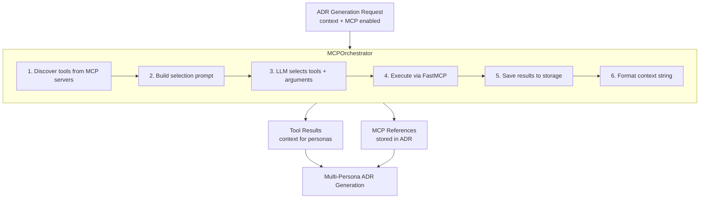

# MCP (Model Context Protocol) Integration

This document describes how Decision Analyzer integrates with MCP servers to gather additional context during ADR generation using **AI-driven tool orchestration**.

## Overview

MCP allows the system to call external tools during ADR generation. Rather than manual tool selection, an **AI orchestrator** analyzes the generation context and autonomously decides which tools to call and with what arguments.

### Key Features

- **AI-Driven Tool Selection**: LLM analyzes context and selects relevant tools automatically
- **Automatic Argument Generation**: Tool arguments derived from decision context
- **Result Storage**: All tool results stored for transparency and debugging
- **References Visibility**: MCP results appear in ADR references and are viewable as JSON

## Architecture



## Generation UI

The frontend provides a simple checkbox to enable MCP tool orchestration.

When enabled:
- Orchestrator analyzes the context
- LLM selects relevant tools based on the decision topic
- Tool results are gathered before persona generation begins
- All personas receive the same tool context
- Results are stored and appear in ADR references

## MCP References in ADR

Tool results appear in the ADR's References section with purple "MCP: ServerName" badges:

```
References
├── [Decision] Previous Caching ADR
├── [Principle] Performance First  
├── [MCP: GitHub] Repository search results
└── [MCP: Web Search] Industry best practices
```

Clicking an MCP reference opens a modal displaying the full JSON result:

```json
{
  "id": "result-uuid",
  "adr_id": "adr-uuid",
  "server_id": "github",
  "server_name": "GitHub MCP",
  "tool_name": "search_repositories",
  "arguments": {"query": "caching strategy", "limit": 5},
  "result": { ... full tool response ... },
  "executed_at": "2024-01-15T10:30:00Z"
}
```

## API Endpoints

### MCP Server Management

| Method | Endpoint | Description |
|--------|----------|-------------|
| GET | `/api/v1/mcp/servers` | List all configured MCP servers |
| POST | `/api/v1/mcp/servers` | Add a new MCP server |
| PUT | `/api/v1/mcp/servers/{id}` | Update an MCP server |
| DELETE | `/api/v1/mcp/servers/{id}` | Remove an MCP server |
| GET | `/api/v1/mcp/servers/{id}/tools` | List tools for a server |
| POST | `/api/v1/mcp/servers/{id}/tools/{tool}/toggle` | Enable/disable a tool |

### MCP Results

| Method | Endpoint | Description |
|--------|----------|-------------|
| GET | `/api/v1/mcp-results/{id}` | Get a specific MCP result |
| GET | `/api/v1/mcp-results?adr_id={adr_id}` | List results for an ADR |
| DELETE | `/api/v1/mcp-results/{id}` | Delete an MCP result |
